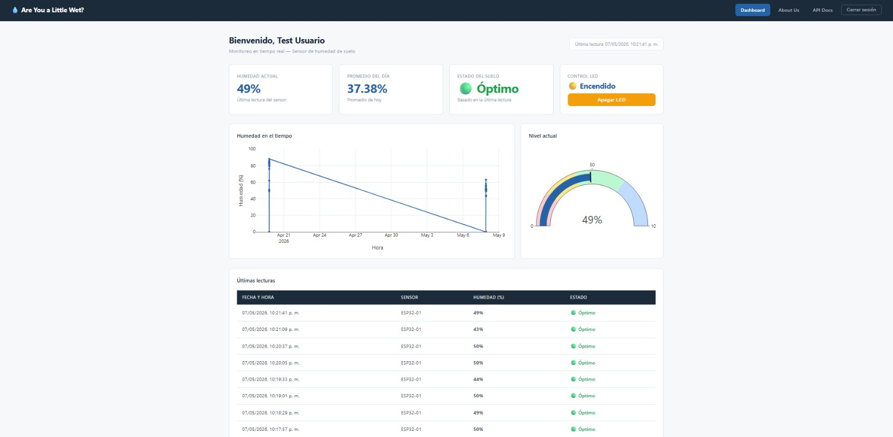
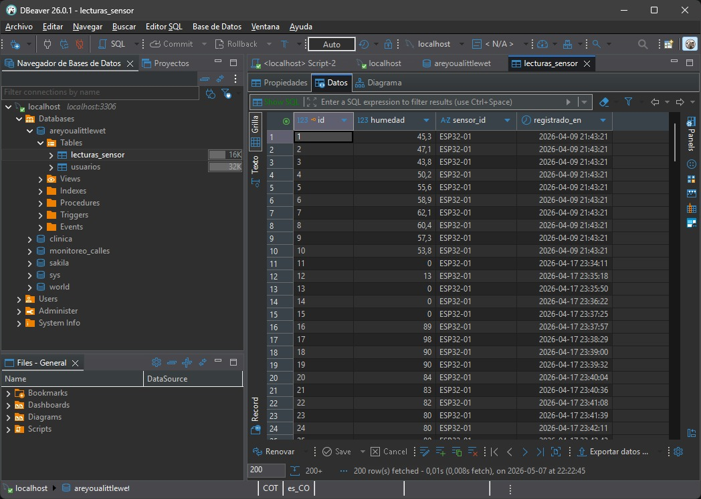
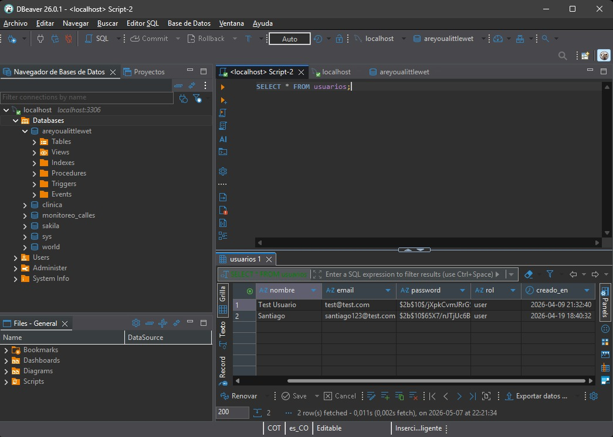
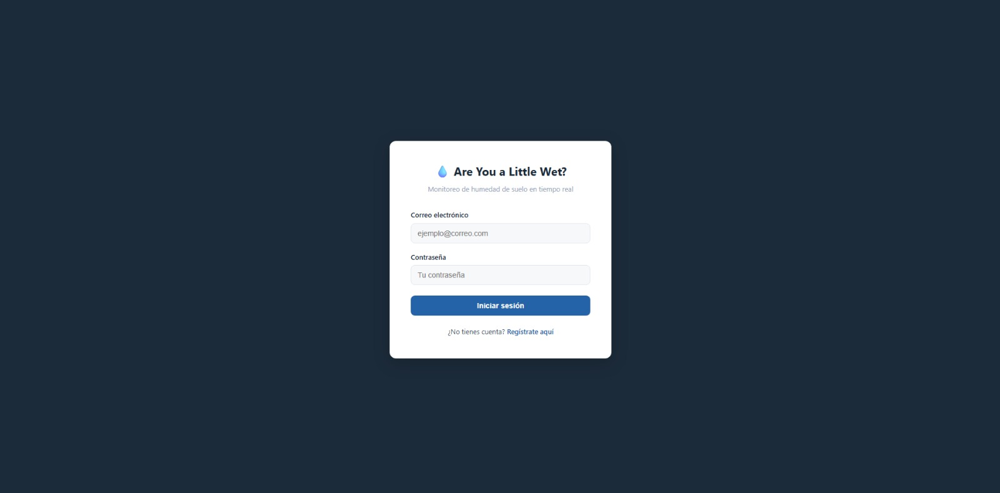
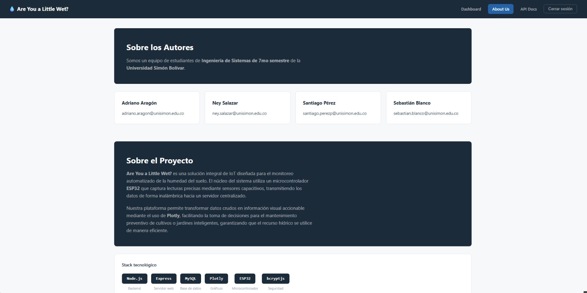
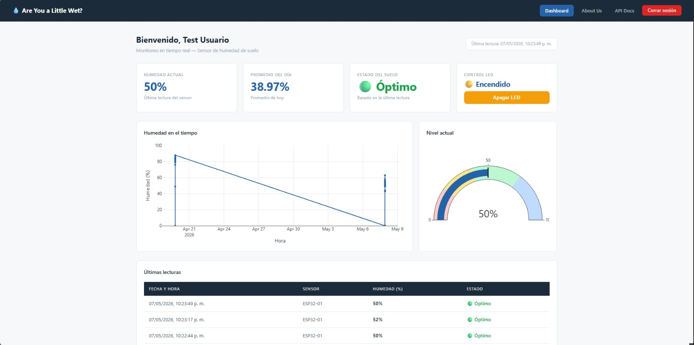
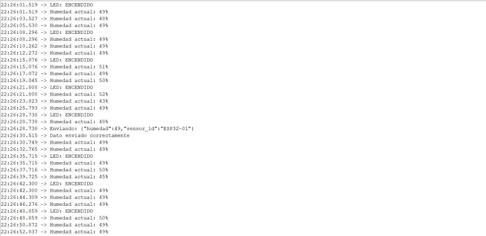
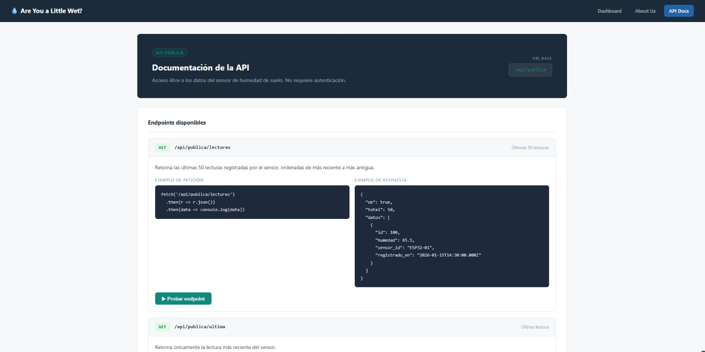
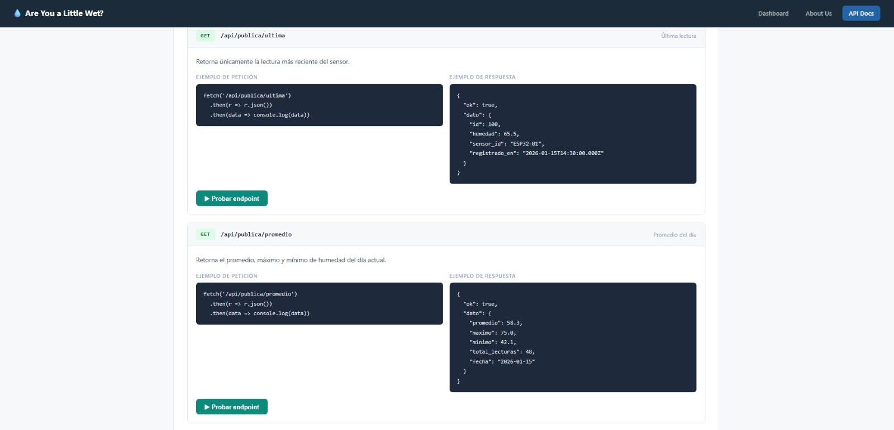
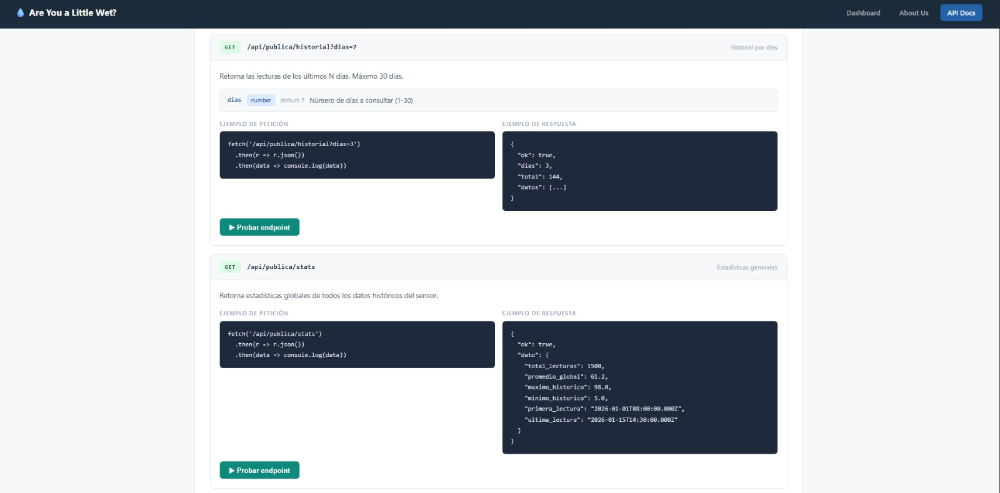

# Are You a Little Wet?
 
Sistema de monitoreo de humedad de suelo en tiempo real, desarrollado como proyecto académico en la **Universidad Simón Bolívar**.

Los datos son recolectados por un sensor capacitivo de humedad conectado a un **ESP32**, almacenados en una base de datos **MySQL** y visualizados en un dashboard web con gráficos interactivos usando **Plotly**.

---

## Requisitos previos

Antes de instalar el proyecto asegúrate de tener:

- [Node.js](https://nodejs.org) v18 o superior
- [MySQL](https://dev.mysql.com/downloads/installer/) v8 o superior
- [DBeaver](https://dbeaver.io/download/) (opcional, para gestionar la BD visualmente)
- [ngrok](https://ngrok.com) (para exponer el servidor localmente)
- IDE de Arduino con soporte para ESP32

---

## Instalación

### 1. Clonar el repositorio

```bash
git clone https://github.com/Adrianoaragon/ProyectoTecnologiasWebs.git
cd ProyectoTecnologiasWebs
```

### 2. Instalar dependencias

```bash
npm install
```

### 3. Configurar variables de entorno

Crea un archivo `.env` en la raíz del proyecto con el siguiente contenido:

DB_HOST=localhost <br>
DB_USER=root <br>
DB_PASSWORD=tu_password_de_mysql <br>
DB_NAME=areyoualittlewet <br>
SESSION_SECRET=una_clave_secreta_cualquiera <br>
PORT=3000 <br>

### 4. Crear la base de datos

Abre DBeaver o el cliente MySQL de tu preferencia y ejecuta:

```sql
CREATE DATABASE areyoualittlewet
  CHARACTER SET utf8mb4
  COLLATE utf8mb4_unicode_ci;

USE areyoualittlewet;

CREATE TABLE usuarios (
    id          INT AUTO_INCREMENT PRIMARY KEY,
    nombre      VARCHAR(100)         NOT NULL,
    email       VARCHAR(150)         NOT NULL UNIQUE,
    password    VARCHAR(255)         NOT NULL,
    rol         ENUM('admin','user') DEFAULT 'user',
    creado_en   TIMESTAMP            DEFAULT CURRENT_TIMESTAMP
);

CREATE TABLE lecturas_sensor (
    id              INT AUTO_INCREMENT PRIMARY KEY,
    humedad         FLOAT        NOT NULL,
    sensor_id       VARCHAR(50)  DEFAULT 'ESP32-01',
    registrado_en   TIMESTAMP    DEFAULT CURRENT_TIMESTAMP
);
```

### 5. Iniciar el servidor

```bash
node server.js
```

El servidor estará disponible en `http://localhost:3000`

### 6. Exponer el servidor con ngrok (opcional)

Para que el ESP32 pueda enviar datos al servidor desde cualquier red:

```bash
ngrok http 3000
```

Copia la URL que genera ngrok y actualiza la constante `SERVER_URL` en el código del ESP32.

---

## Estructura del proyecto

areyoualittlewet/ <br>
├── src/ <br>
│   ├── config/ <br>
│   │   └── db.js              # Conexión a MySQL <br>
│   ├── routes/ <br>
│   │   ├── auth.js            # Login, signup, logout <br>
│   │   ├── sensor.js          # Recepción de datos del ESP32 <br>
│   │   └── publica.js         # API pública para estudiantes <br>
│   └── middlewares/ <br>
│       └── auth.js            # Verificación de sesión <br>
├── public/ <br>
│   ├── css/ <br>
│   │   └── style.css          # Estilos globales <br>
│   └── js/ <br>
│       └── dashboard.js       # Lógica del dashboard <br>
├── views/ <br>
│   ├── login.html             # Página de login <br>
│   ├── signup.html            # Página de registro <br>
│   ├── dashboard.html         # Dashboard principal <br>
│   ├── about.html             # Sobre el proyecto <br>
│   └── docs.html              # Documentación de la API <br>
├── .env                       # Variables de entorno (no subir a GitHub) <br>
├── .gitignore <br>
├── server.js                  # Servidor principal <br>
└── package.json 

---

## Configuración del ESP32

### Hardware necesario

- ESP32 (cualquier modelo)
- Sensor de humedad de suelo capacitivo
- Cable USB para programación

### Conexión del sensor

| Sensor | ESP32 |
|--------|-------|
| VCC    | 3.3V  |
| GND    | GND   |
| AOUT   | Pin 34|

### Librerías de Arduino necesarias

- `WiFi.h` (incluida en el core de ESP32)
- `HTTPClient.h` (incluida en el core de ESP32)
- `WebServer.h` (incluida en el core de ESP32)

### Configuración del código Arduino

Antes de cargar el código al ESP32 actualiza estas constantes:

```cpp
#define WIFI_SSID     "tu_red_wifi"
#define WIFI_PASSWORD "tu_password_wifi"
#define SERVER_URL    "https://tu-url-ngrok.ngrok-free.app/api/sensor/data"
```

### Calibración del sensor

```cpp
const int seco   = 3500; // Valor en aire (tierra completamente seca)
const int mojado = 1500; // Valor en agua (tierra completamente saturada)
```

Ajusta estos valores según tu sensor específico.

---
### Control del LED integrado desde el servidor

El ESP32 consulta periódicamente el servidor para saber si debe encender o apagar su LED integrado (pin 2). Esta función se ejecuta en el `loop()`:

```cpp
// ── CONSULTAR ESTADO DEL LED ─────────────────────────────
void consultarLed() {
  if (WiFi.status() != WL_CONNECTED) return;
  WiFiClientSecure client;
  client.setInsecure();
  HTTPClient http;
  http.begin(client, "https://tu-url-ngrok.ngrok-free.app/api/sensor/led");
  http.addHeader("ngrok-skip-browser-warning", "true");
  int httpCode = http.GET();
  if (httpCode == 200) {
    String respuesta = http.getString();
    // Si la respuesta contiene "true" encendemos, si no apagamos
    if (respuesta.indexOf("true") >= 0) {
      digitalWrite(LED_PIN, HIGH);
      Serial.println("LED: ENCENDIDO");
    } else {
      digitalWrite(LED_PIN, LOW);
      Serial.println("LED: APAGADO");
    }
  }
  http.end();
}
```
---
## API Pública

La API es de acceso libre. No requiere autenticación.

**URL base:** `https://tu-url-ngrok.ngrok-free.app/api/publica`

### Endpoints disponibles

#### `GET /lecturas`
Retorna las últimas 50 lecturas del sensor.

**Ejemplo de respuesta:**
```json
{
  "ok": true,
  "total": 50,
  "datos": [
    {
      "id": 100,
      "humedad": 65.5,
      "sensor_id": "ESP32-01",
      "registrado_en": "2026-01-15T14:30:00.000Z"
    }
  ]
}
```

---

#### `GET /ultima`
Retorna la lectura más reciente del sensor.

**Ejemplo de respuesta:**
```json
{
  "ok": true,
  "dato": {
    "id": 100,
    "humedad": 65.5,
    "sensor_id": "ESP32-01",
    "registrado_en": "2026-01-15T14:30:00.000Z"
  }
}
```

---

#### `GET /promedio`
Retorna el promedio, máximo y mínimo del día actual.

**Ejemplo de respuesta:**
```json
{
  "ok": true,
  "dato": {
    "promedio": 58.3,
    "maximo": 75.0,
    "minimo": 42.1,
    "total_lecturas": 48,
    "fecha": "2026-01-15"
  }
}
```

---

#### `GET /historial?dias=7`
Retorna las lecturas de los últimos N días (máximo 30).

**Parámetros:**

| Parámetro | Tipo   | Default | Descripción              |
|-----------|--------|---------|--------------------------|
| dias      | number | 7       | Número de días a consultar |

**Ejemplo de uso:**

/api/publica/historial?dias=3
/api/publica/historial?dias=30

---

#### `GET /stats`
Retorna estadísticas generales de todos los datos históricos.

**Ejemplo de respuesta:**
```json
{
  "ok": true,
  "dato": {
    "total_lecturas": 1500,
    "promedio_global": 61.2,
    "maximo_historico": 98.0,
    "minimo_historico": 5.0,
    "primera_lectura": "2026-01-01T08:00:00.000Z",
    "ultima_lectura": "2026-01-15T14:30:00.000Z"
  }
}
```

---

## Seguridad

- Las contraseñas de usuarios se almacenan encriptadas con **bcryptjs**
- Se usa **express-session** para manejo de sesiones
- Las rutas del dashboard requieren sesión activa
- Las consultas SQL usan **prepared statements** para prevenir SQL injection
- El archivo `.env` nunca se sube al repositorio

---

## Evidencias

A continuación se presentan las evidencias del funcionamiento del sistema, organizadas según los requisitos del proyecto.

---

### 1. Dashboard en Plotly

El dashboard muestra los datos del sensor en tiempo real mediante gráficos interactivos generados con **Plotly**: una gráfica de línea con el histórico de humedad, un gauge con el nivel actual y tarjetas de métricas (humedad actual, promedio del día y estado del suelo).

> 📷 *Captura del dashboard principal con gráficos y métricas en funcionamiento.*



---

### 2. Base de datos (MySQL)

Se utiliza **MySQL** como motor de base de datos. La base `areyoualittlewet` contiene dos tablas: `lecturas_sensor`, que almacena cada lectura enviada por el ESP32, y `usuarios`, que guarda los usuarios registrados con contraseñas hasheadas mediante **bcryptjs**.

> 📷 *Vista de la tabla `lecturas_sensor` en DBeaver con registros reales del sensor.*



> 📷 *Vista de la tabla `usuarios` con contraseñas hasheadas.*



---

### 3. Login, Logout y About

El sistema cuenta con autenticación por sesión. Los usuarios pueden registrarse, iniciar sesión y cerrar sesión. La página **About** presenta al equipo de desarrollo y la descripción del proyecto.

> 📷 *Página de login con formulario de autenticación.*



> 📷 *Página About Us con información del equipo y stack tecnológico.*



---

### 4. Lectura y Push de datos entre sensor y LED

El ESP32 envía lecturas de humedad al servidor mediante `POST /api/sensor/data` y consulta periódicamente el endpoint `GET /api/sensor/led` para recibir la orden de encender o apagar su LED integrado. El dashboard incluye un botón de control LED que actualiza el estado en el servidor en tiempo real.

> 📷 *Dashboard mostrando el control del LED encendido.*



> 📷 *Monitor serial del ESP32 confirmando la recepción de la orden del LED y el envío de datos de humedad.*



---

### 5. API REST — GET, POST

La API pública (`/api/publica`) expone endpoints **GET** sin autenticación para consultar lecturas, promedios e historial. La ruta `/api/sensor/data` recibe datos del ESP32 mediante **POST**. La ruta `/api/sensor/led` acepta **POST** desde el dashboard y **GET** desde el ESP32.

La documentación interactiva está disponible en la ruta `/docs` de la aplicación.

> 📷 *Documentación de la API con endpoints GET disponibles y ejemplos de respuesta.*



> 📷 *Endpoints de promedio, historial y estadísticas generales.*



> 📷 *Guía de uso rápido con ejemplos en JavaScript, Python, Arduino y curl.*



---

## Autores

- **Adriano Aragon** — Universidad Simón Bolívar, Facultad de Ingenierías
- **Sebastian Blanco** — Universidad Simón Bolívar, Facultad de Ingenierías
- **Santiago Perez** — Universidad Simón Bolívar, Facultad de Ingenierías
- **Ney Salazar** — Universidad Simón Bolívar, Facultad de Ingenierías
- Curso: Tecnologías Web
- Docente: Ing. Msc. Daniel De la Rosa

---

## Licencia

Proyecto académico — Universidad Simón Bolívar © 2026

